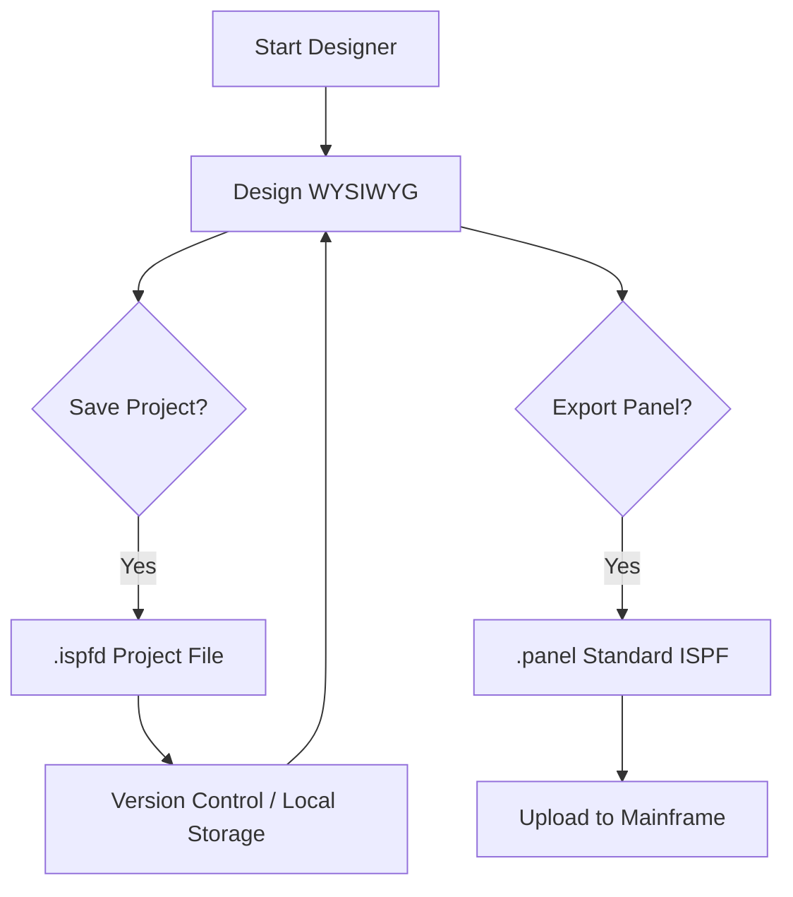

# ISPF Designer: Professional User Manual
**Version 1.0 (2025)**

---

## 1. Introduction
ISPF Designer is a modern, high-performance, WYSIWYG editor designed for systems programmers and mainframe developers. It simplifies the creation of ISPF (Interactive System Productivity Facility) panels by providing a real-time, terminal-based design environment that mirrors the mainframe experience while offering the flexibility of a local development tool.

Designed with **Native AOT (Ahead-of-Time)** compilation in mind, ISPF Designer is a single-binary, zero-dependency application capable of running at near-instant speeds on both Windows and Linux systems.

---

## 2. Core Architecture: The Project Model
Unlike traditional editors that embed design metadata directly into output files, ISPF Designer utilizes a **Project-First Workflow**.

### 2.1 The .ispfd Format
The `.ispfd` (ISPF Designer Project) file is the source of truth for your design. It stores:
- **WYSIWYG Buffer**: The visual layout of your panel.
- **Dynamic Attributes**: Custom attribute definitions (F4).
- **Extended Field Metadata**: Variable names, lengths, and data types (F6).

### 2.2 Workflow Visualization


---

## 3. Getting Started

### 3.1 Installation
ISPF Designer is distributed as a single executable. No installation is required.

### 3.2 Building from Source
Requires **.NET 9.0 SDK**.

**Windows:**
```powershell
dotnet publish -c Release -r win-x64 --self-contained
```

**Linux (Native AOT):**
```bash
./build.sh
```

---

## 4. The Designer Interface

### 4.1 The Status Bar
The top line provides real-time information:
`Pos: 01,01 | DSGN | F1:Help F2:Save F3:Load F4:Attr F5:Test F6:Fld F7:Exp ESC:Exit`

- **Pos**: Current cursor position (Row, Column).
- **Mode**: `DSGN` (Design) or `TEST` (Runtime Simulation).

### 4.2 Coordinate System
The editor operates on a standard 24x80 grid, matching the traditional 3270 terminal display.

---

## 5. Function Key Reference

| **Arrow Keys** | DSGN/TEST | Move cursor around the screen. |
| **ENTER** | DSGN | **Quick Field Edit**: Opens properties IF on the attribute character. Else moves to next line. |
| **ENTER** | TEST | **Newline**: Moves cursor to the start of the next line. |
| **F1** | Help | Displays a comprehensive overlay with keyboard shortcuts. |
| **F2** | Save | Persists the current state to a `.ispfd` source file. |
| **F3** | Load | **File Browser**: Lists available `.ispfd` / `.panel` files and restores state. |
| **F4** | Attr | Opens the Attribute Manager to define custom ISPF characters. |
| **F5** | Test | Switches to Test Mode to simulate panel runtime behavior. |
| **F6** | Field | Configures variable properties for the field under the cursor. |
| **F7** | Export | Generates a clean, deployable `.panel` file. |
| **ESC** | Exit | Safely closes the application. |

---

## 6. Advanced Design Features

### 6.1 Custom Attributes (F4)
Define how your panel looks and behaves.
- **TYPE**: TEXT (protected) or INPUT/PASSWORD (unprotected).
- **COLOR**: White, Red, Blue, Green, Yellow, Pink, Turq.
- **INTENS**: HIGH, LOW, or NON (invisible).

### 6.2 Field Management (F6)
When the cursor is on an input field (e.g., following a `_`), press **F6** to:
1.  **Assign Name**: Set the Z-variable or application variable name.
2.  **Set Length**: Define the visual length of the field.
3.  **Validate Type**: Set ALPHA, NUM, or TEXT validation.

### 6.3 Test Mode (F5)
Validate your layout before exporting. In Test Mode:
- Input fields become interactive.
- Hidden attributes (PASSWORDS) are masked.
- Colors are rendered exactly as they appear on the mainframe.

---

## 7. Exporting to the Mainframe
When your design is complete, press **F7** to export. The resulting `.panel` file uses clean, standard syntax:
- `)ATTR`: Dynamic attribute definitions.
- `)BODY`: Clean panel layout.
- `)INIT`: Automatic `.ZVARS` mapping based on F6 configurations.
- `)PROC` / `)END`: Standard sections for integration.

---

## 8. Professional Tips
- **Legacy Migration**: Load existing `.panel` files with F3; the designer will automatically attempt to reconstruct field properties from `.ZVARS`.
- **Keyboard Navigation**: Use **Backspace** and **Delete** for quick character manipulation; the editor automatically handles buffer updates.
- **Linux Usage**: For the best experience on Linux, ensure your terminal supports UTF-8 and 256-color output.

---

> [!TIP]
> **Conversion to PDF:** To generate a PDF version of this manual, open this document in any modern Markdown viewer and select **Print -> Save as PDF**.
